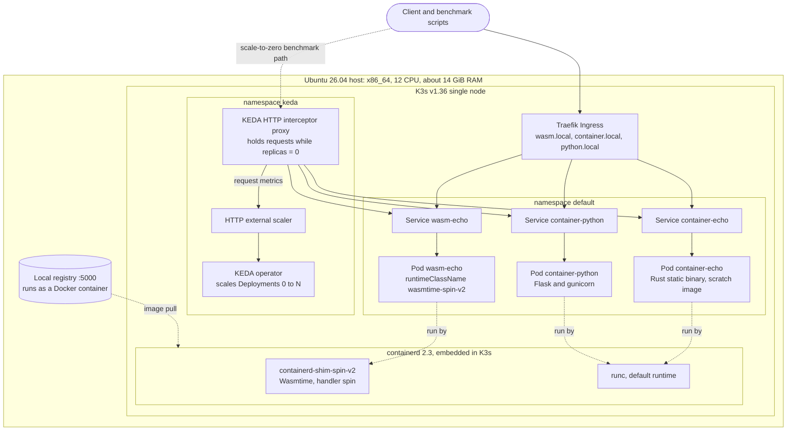
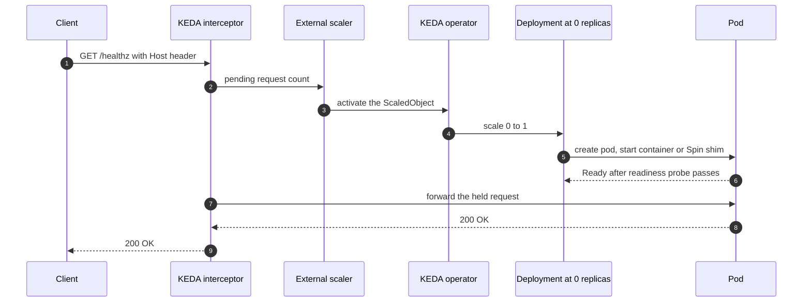
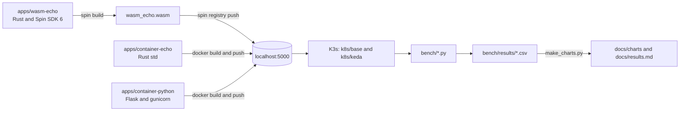
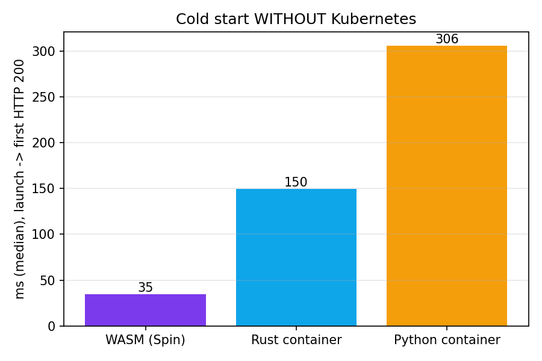
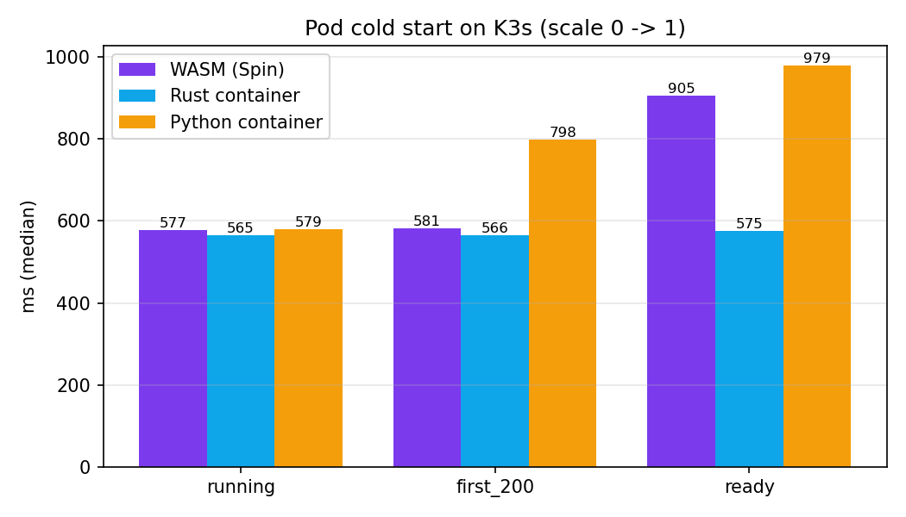
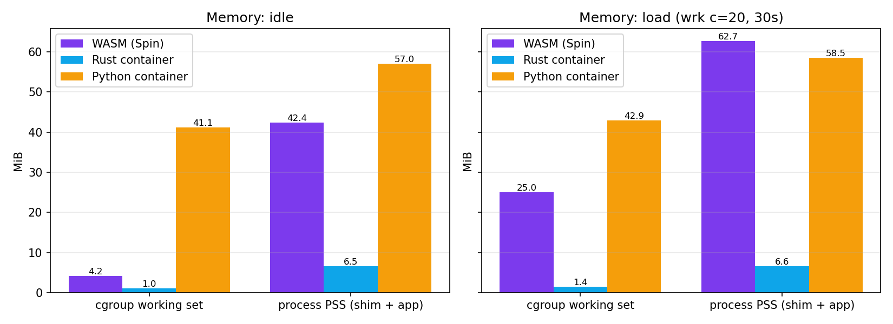
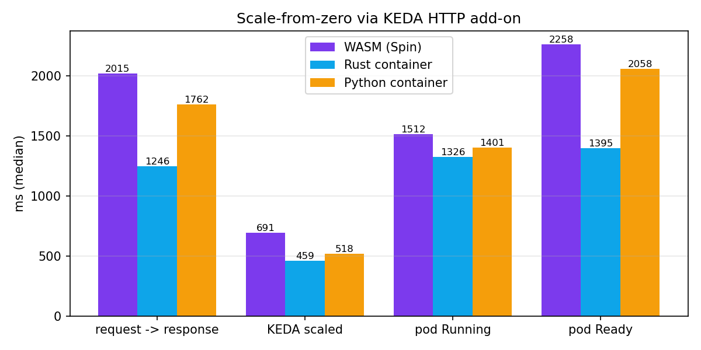
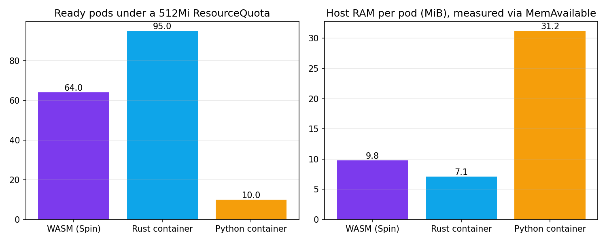

# wasm-edge-k3s

Edge computing with WebAssembly: **K3s + containerd-shim-spin (Wasmtime) + Fermyon Spin**, running WASM workloads side by side with regular containers in the same cluster, and measuring cold start, memory, scale-to-zero, constrained-edge behaviour and portability.

Everything in this repository was built and measured on a single Ubuntu machine. The numbers are real, the conclusions are honest, and several of them are **not** what the "WASM is dramatically faster and smaller" narrative predicts. See [Key findings](#key-findings).

---

## Table of contents

1. [Key findings](#key-findings)
2. [Architecture](#architecture)
3. [Repository layout](#repository-layout)
4. [Environment and versions](#environment-and-versions)
5. [Step-by-step implementation](#step-by-step-implementation)
   - [Step 0: Repository setup](#step-0-repository-setup)
   - [Step 1: K3s and the Spin shim](#step-1-k3s-and-the-spin-shim)
   - [Step 2: Build the WASM workload](#step-2-build-the-wasm-workload)
   - [Step 3: Deploy WASM and containers side by side](#step-3-deploy-wasm-and-containers-side-by-side)
   - [Step 4: Cold start and memory comparison](#step-4-cold-start-and-memory-comparison)
   - [Step 5: Scale to zero with KEDA](#step-5-scale-to-zero-with-keda)
   - [Step 6: Edge simulation](#step-6-edge-simulation)
   - [Step 7: Portability test](#step-7-portability-test)
   - [Step 8: Charts and documentation](#step-8-charts-and-documentation)
6. [When to choose WASM and when not to](#when-to-choose-wasm-and-when-not-to)
7. [Limitations and deviations from the task](#limitations-and-deviations-from-the-task)
8. [Problems hit along the way](#problems-hit-along-the-way)
9. [Full reproduction order](#full-reproduction-order)
10. [Cleanup](#cleanup)

More detail: [docs/findings.md](docs/findings.md) (all results), [docs/tradeoffs.md](docs/tradeoffs.md) (decision guide), [docs/results.md](docs/results.md) (auto-generated tables), [docs/architecture.md](docs/architecture.md).

---

## Key findings

Three implementations of the same three endpoints (`/healthz`, `/`, `/echo`):

| Name | Implementation |
|---|---|
| **WASM (Spin)** | Rust + Spin SDK 6, one 176 KiB `.wasm`, run by the Spin shim via RuntimeClass `wasmtime-spin-v2` |
| **Rust container** | Rust std only, static musl binary in a `scratch` image (the best case for a container) |
| **Python container** | Flask + gunicorn (1 worker, 2 threads) on `python:3.13-slim` (a typical container) |

| Question | Result on this setup |
|---|---|
| Does WASM start faster than a container? | **Yes at the runtime level**: 35 ms vs 150 ms (Rust) vs 306 ms (Python). **Not at the Kubernetes pod level**: all three reach Running in about 570-580 ms. |
| Does it scale from zero faster? | **No, it was the slowest**: median 2.0 s vs 1.25 s (Rust) vs 1.76 s (Python), mostly the time between Running and Ready. |
| Does it use less memory? | **Versus Python: less at idle** (cgroup about 10x, total PSS about 26%), about equal under light load. **Versus a static Rust container: 4 to 10x more.** |
| Does it fit more workloads per unit of hardware? | **Versus Python, yes**: 64 vs 10 pods under a 512Mi quota. **Versus static Rust, no.** |
| Does the same binary run on another architecture? | **Yes**: identical sha256 on emulated arm64. The runtime itself is per-architecture. |

Two more results worth knowing:

- **Kubernetes memory accounting under-counts WASM pods.** The pod cgroup shows about 4 MiB, but about 10-20 MiB of real host RAM is used per pod, because the shim processes sit outside the pod cgroup.
- **Typical containers struggle where WASM does not.** With an 8 MiB memory limit the WASM pod served about 10.7k req/s while the Python container was OOMKilled at every limit up to 32 MiB (it needed 48 MiB).

---

## Architecture

### Cluster topology

A single-node K3s cluster. To Kubernetes, the WASM pod differs from a container pod only by `runtimeClassName`.



Notes:

- The scale-from-zero benchmark sent requests **directly to the interceptor's ClusterIP**, not through Traefik. Chaining Traefik to the interceptor was not built or tested.
- Containers run through the default runtime (`runc`). Only the WASM pod goes through the Spin shim.

### Scale-from-zero request flow (KEDA HTTP add-on)



### Build, deploy and measure pipeline



---

## Repository layout

```
wasm-edge-k3s/
├── README.md
├── apps/
│   ├── wasm-echo/          # Rust + Spin SDK 6 -> wasm32-wasip2 (spin.toml, src/lib.rs)
│   ├── container-echo/     # Rust std-only HTTP server, scratch image (Dockerfile, src/main.rs)
│   └── container-python/   # Flask + gunicorn (Dockerfile, app.py)
├── k8s/
│   ├── base/               # RuntimeClass, Deployments, Services, Ingress
│   └── keda/               # InterceptorRoute + ScaledObject for the three workloads
├── scripts/
│   ├── 01-install-k3s-wasm.sh
│   ├── 02-install-spin-cli.sh
│   └── 07-portability-test.sh
├── bench/
│   ├── runtime_start.py    # cold start without Kubernetes
│   ├── coldstart.py        # pod cold start on K3s (scale 0 -> 1)
│   ├── memory.py           # cgroup + PSS memory, idle and under load
│   ├── scale_from_zero.py  # scale-from-zero through the KEDA interceptor
│   ├── edge_limits.py      # minimum viable memory limit sweep
│   ├── density.py          # replica sweep and 512Mi ResourceQuota fit
│   ├── make_charts.py      # CSV -> charts + docs/results.md
│   └── results/            # CSV and raw output of every run (including earlier runs)
└── docs/
    ├── architecture.md
    ├── findings.md         # all results with caveats
    ├── tradeoffs.md        # when to choose WASM and when not to
    ├── results.md          # auto-generated tables
    ├── charts/             # PNG charts
    └── evidence/           # raw command output (pods, ingress, portability, KEDA overhead, ...)
```

---

## Environment and versions

| Component | Version |
|---|---|
| OS | Ubuntu 26.04.1 LTS, x86_64, 12 CPUs, about 14 GiB RAM (desktop session also running) |
| Kubernetes | K3s v1.36.4+k3s1, single node |
| containerd | 2.3.x (embedded in K3s) |
| WASM shim | containerd-shim-spin v0.25.1 (embeds Spin 4.0.1) |
| Spin CLI / SDK | 4.0.1 / `spin-sdk` 6.0.0, Rust target `wasm32-wasip2` |
| Docker | 29.1.3 (image builds and the local registry) |
| KEDA + HTTP add-on | Helm charts `kedacore/keda` and `kedacore/keda-add-ons-http` (add-on with the `InterceptorRoute` API, v0.14 or later) |
| Load and tooling | `wrk`, Python 3, `jq`, `helm`, `matplotlib` |

**Version alignment matters.** The Spin CLI and SDK must match the Spin runtime embedded in the shim. The shim's compatibility table pairs shim v0.25.1 with Spin v4.0.1, and Spin 4 templates target `wasm32-wasip2`.

---

## Step-by-step implementation

Every step lists the commands, then the result that was observed.

### Step 0: Repository setup

```bash
mkdir -p ~/wasm-edge-k3s && cd ~/wasm-edge-k3s
git init -b main
git remote add origin https://github.com/<your-user>/wasm-edge-k3s.git
mkdir -p apps/wasm-echo apps/container-echo k8s/base k8s/keda scripts bench docs
```

If GitHub created a `LICENSE` when the repository was made, the first push is rejected. Merge it and push:

```bash
git pull origin main --allow-unrelated-histories --no-rebase
git push -u origin main
```

### Step 1: K3s and the Spin shim

Recent K3s versions detect a shim binary on the node's `PATH` and add a matching containerd runtime automatically, so the flow is: install K3s, put the shim on the `PATH`, restart K3s.

```bash
sudo apt-get update && sudo apt-get install -y curl jq

# installs K3s, downloads containerd-shim-spin-v2 for this architecture into /usr/local/bin, restarts K3s
./scripts/01-install-k3s-wasm.sh
# pin a shim version instead of "latest":  SHIM_VERSION=v0.25.1 ./scripts/01-install-k3s-wasm.sh

# kubectl access
mkdir -p ~/.kube
sudo cp /etc/rancher/k3s/k3s.yaml ~/.kube/config
sudo chown $USER:$USER ~/.kube/config
echo 'export KUBECONFIG=$HOME/.kube/config' >> ~/.bashrc
export KUBECONFIG=$HOME/.kube/config

# verify
kubectl get nodes -o wide
which containerd-shim-spin-v2
sudo grep -n -i -B1 -A3 'spin' /var/lib/rancher/k3s/agent/etc/containerd/config.toml
kubectl get runtimeclass
```

**Result**

- The node is `Ready` (v1.36.4+k3s1, containerd 2.3.x).
- K3s generated a `spin` runtime in the containerd config (`runtime_type = "io.containerd.spin.v2"`, `BinaryName = "/usr/local/bin/containerd-shim-spin-v2"`, `SystemdCgroup = true`).
- K3s also pre-created RuntimeClasses for several runtimes (`crun`, `lunatic`, `nvidia`, `slight`, `spin`, `wasmedge`, `wasmer`, `wasmtime`, `wws`). Only `spin` has a shim installed on this node.

Create our own explicit RuntimeClass (the task asks for one, and explicit manifests beat relying on what K3s generates):

```bash
cat > k8s/base/runtimeclass-spin.yaml << 'EOF'
apiVersion: node.k8s.io/v1
kind: RuntimeClass
metadata:
  name: wasmtime-spin-v2
handler: spin
EOF
kubectl apply -f k8s/base/runtimeclass-spin.yaml
```

Smoke test with the official Spin example image before building anything of our own:

```bash
kubectl apply -f - << 'EOF'
apiVersion: apps/v1
kind: Deployment
metadata:
  name: wasm-smoke
spec:
  replicas: 1
  selector:
    matchLabels:
      app: wasm-smoke
  template:
    metadata:
      labels:
        app: wasm-smoke
    spec:
      runtimeClassName: wasmtime-spin-v2
      containers:
      - name: hello
        image: ghcr.io/spinframework/containerd-shim-spin/examples/spin-rust-hello:v0.20.0
        command: ["/"]
EOF
kubectl rollout status deploy/wasm-smoke --timeout=120s
kubectl port-forward deploy/wasm-smoke 8080:80 &
sleep 2; curl -s localhost:8080/hello; kill %1
kubectl delete deploy wasm-smoke
```

**Result:** the pod went `Running 1/1` and `curl` returned `Hello world from Spin!`.

### Step 2: Build the WASM workload

```bash
# Rust toolchain and the WASM target
sudo apt-get install -y build-essential pkg-config libssl-dev
curl --proto '=https' --tlsv1.2 -sSf https://sh.rustup.rs | sh -s -- -y
. "$HOME/.cargo/env"
rustup target add wasm32-wasip2

# Spin CLI at the version embedded in the shim (default v4.0.1)
./scripts/02-install-spin-cli.sh

# scaffold from the matching templates
spin templates install --git https://github.com/spinframework/spin --branch v4.0.1 --upgrade
cd apps && rmdir wasm-echo
spin new --accept-defaults -t http-rust wasm-echo
cd wasm-echo
```

Add a release profile (smaller binary, fair comparison with the native build):

```bash
cat >> Cargo.toml << 'EOF'

[profile.release]
opt-level = "s"
lto = true
codegen-units = 1
strip = true
panic = "abort"
EOF
```

`apps/wasm-echo/src/lib.rs`: `/healthz`, `/` and `/echo`. `/echo` returns the request's method, path, query and user-agent as JSON. Reading the request body was left out on purpose (the SDK 6 body API was not verified).

```rust
use spin_sdk::http::{IntoResponse, Request, Response};
use spin_sdk::http_service;

// Same builder chain for every reply so all match arms have one type.
macro_rules! reply {
    ($status:literal, $body:expr) => {
        Response::builder()
            .status($status)
            .header("content-type", "application/json")
            .body($body)
    };
}

fn json_escape(s: &str) -> String {
    let mut out = String::with_capacity(s.len());
    for c in s.chars() {
        match c {
            '"' => out.push_str("\\\""),
            '\\' => out.push_str("\\\\"),
            '\n' => out.push_str("\\n"),
            '\r' => out.push_str("\\r"),
            '\t' => out.push_str("\\t"),
            c if (c as u32) < 0x20 => out.push_str(&format!("\\u{:04x}", c as u32)),
            c => out.push(c),
        }
    }
    out
}

#[http_service]
async fn handle_wasm_echo(req: Request) -> anyhow::Result<impl IntoResponse> {
    let method = req.method().as_str().to_owned();
    let path = req.uri().path().to_owned();
    let query = req.uri().query().unwrap_or("").to_owned();
    let user_agent = req
        .headers()
        .get("user-agent")
        .and_then(|v| v.to_str().ok())
        .unwrap_or("")
        .to_owned();

    let resp = match (method.as_str(), path.as_str()) {
        ("GET", "/healthz") => reply!(200, r#"{"status":"ok"}"#.to_string()),
        ("GET", "/") => reply!(200, r#"{"service":"echo","runtime":"wasm"}"#.to_string()),
        (_, "/echo") => reply!(
            200,
            format!(
                r#"{{"runtime":"wasm","method":"{}","path":"{}","query":"{}","user_agent":"{}"}}"#,
                json_escape(&method),
                json_escape(&path),
                json_escape(&query),
                json_escape(&user_agent)
            )
        ),
        _ => reply!(404, r#"{"error":"not found"}"#.to_string()),
    };
    Ok(resp)
}
```

`apps/wasm-echo/spin.toml` (generated by the template, unchanged):

```toml
spin_manifest_version = 2

[application]
name = "wasm-echo"
version = "0.1.0"

[[trigger.http]]
route = "/..."
component = "wasm-echo"

[component.wasm-echo]
source = "target/wasm32-wasip2/release/wasm_echo.wasm"
allowed_outbound_hosts = []
[component.wasm-echo.build]
command = "cargo build --target wasm32-wasip2 --release"
watch = ["src/**/*.rs", "Cargo.toml"]
```

Build and test locally:

```bash
spin build
ls -lh target/wasm32-wasip2/release/wasm_echo.wasm

spin up --listen 127.0.0.1:3000 &
sleep 2
curl -s localhost:3000/healthz; echo
curl -s localhost:3000/; echo
curl -s "localhost:3000/echo?msg=hello"; echo
curl -s -o /dev/null -w "%{http_code}\n" localhost:3000/nope
kill %1
```

**Result**

```text
{"status":"ok"}
{"service":"echo","runtime":"wasm"}
{"runtime":"wasm","method":"GET","path":"/echo","query":"msg=hello","user_agent":"curl/8.18.0"}
404
```

The hello-world template produced a 297 KiB `.wasm`; with the release profile and the real handler it is **176 KiB**.

### Step 3: Deploy WASM and containers side by side

**Local registry** so K3s can pull images:

```bash
docker run -d --restart=always --name registry -p 127.0.0.1:5000:5000 registry:2
curl -s localhost:5000/v2/_catalog        # {"repositories":[]}

sudo tee /etc/rancher/k3s/registries.yaml > /dev/null << 'EOF'
mirrors:
  "localhost:5000":
    endpoint:
      - "http://localhost:5000"
EOF
sudo systemctl restart k3s
kubectl wait --for=condition=Ready node --all --timeout=120s
```

**Push the WASM app as an OCI artifact:**

```bash
cd apps/wasm-echo
spin registry push --insecure localhost:5000/wasm-echo:v1
```

**Container equivalents.** Same three endpoints, so the comparison is like for like:

- `apps/container-echo`: Rust standard library only (no framework), one thread per connection, HTTP keep-alive, built into a static musl binary in a `scratch` image. This is deliberately the **best case for a container**.
- `apps/container-python`: Flask + gunicorn (1 worker, 2 threads), the **typical case**.

```bash
# apps/container-echo/Dockerfile
#   FROM rust:1-alpine AS build ... cargo build --release
#   FROM scratch / COPY the binary / USER 65532:65532 / ENTRYPOINT ["/container-echo"]

cd apps/container-echo
docker build -t localhost:5000/container-echo:v2 . && docker push localhost:5000/container-echo:v2

cd ../container-python
docker build -t localhost:5000/container-python:v1 . && docker push localhost:5000/container-python:v1
```

> `container-echo:v1` closed every connection after one response, which made the first throughput comparison unfair. `v2` adds keep-alive. The v1 results are kept in `bench/results/baseline/`.

**Kubernetes manifests.** The WASM Deployment differs from a normal one only by `runtimeClassName`. Images use `imagePullPolicy: IfNotPresent` so pulls never pollute cold-start numbers. `k8s/base/wasm-echo.yaml`:

```yaml
apiVersion: apps/v1
kind: Deployment
metadata:
  name: wasm-echo
  labels:
    app: wasm-echo
    workload-type: wasm
spec:
  replicas: 1
  selector:
    matchLabels:
      app: wasm-echo
  template:
    metadata:
      labels:
        app: wasm-echo
        workload-type: wasm
    spec:
      terminationGracePeriodSeconds: 2
      runtimeClassName: wasmtime-spin-v2      # the only WASM-specific line
      containers:
      - name: wasm-echo
        image: localhost:5000/wasm-echo:v1
        imagePullPolicy: IfNotPresent
        command: ["/"]
        ports:
        - containerPort: 80
        readinessProbe:
          httpGet:
            path: /healthz
            port: 80
          periodSeconds: 1
---
apiVersion: v1
kind: Service
metadata:
  name: wasm-echo
spec:
  selector:
    app: wasm-echo
  ports:
  - port: 80
    targetPort: 80
```

`k8s/base/container-echo.yaml` and `k8s/base/container-python.yaml` have the same shape (no `runtimeClassName`, container port 8080). `k8s/base/ingress.yaml` is one Traefik Ingress with three host rules (`wasm.local`, `container.local`, `python.local`).

```bash
kubectl apply -f k8s/base/
kubectl rollout status deploy/wasm-echo --timeout=120s
kubectl rollout status deploy/container-echo --timeout=120s
kubectl rollout status deploy/container-python --timeout=180s

kubectl get pods,svc,ingress -o wide
kubectl get pods -o custom-columns='NAME:.metadata.name,RUNTIME_CLASS:.spec.runtimeClassName,READY:.status.containerStatuses[0].ready,IP:.status.podIP'

curl -s -H 'Host: wasm.local'      'http://127.0.0.1/echo?x=1'; echo
curl -s -H 'Host: container.local' 'http://127.0.0.1/echo?x=1'; echo
curl -s -H 'Host: python.local'    'http://127.0.0.1/echo?x=1'; echo
```

**Result**

- Both pods are `1/1 Running` in the same `kubectl get pods`; only the `RUNTIME_CLASS` column differs (`wasmtime-spin-v2` vs `<none>`).
- One Traefik Ingress serves all hosts, and each returns its own `runtime` value:

```text
{"runtime":"wasm","method":"GET","path":"/echo","query":"x=1","user_agent":"curl/8.18.0"}
{"runtime":"container","method":"GET","path":"/echo","query":"x=1","user_agent":"curl/8.18.0"}
```

Raw output: `docs/evidence/part3-pods-svc-ingress.txt`, `docs/evidence/part3-runtimeclass.txt`.

### Step 4: Cold start and memory comparison

```bash
sudo apt-get install -y wrk python3

python3 bench/runtime_start.py 10   | tee bench/results/runtime_start.txt
python3 bench/coldstart.py 10       | tee bench/results/coldstart.txt
sudo env "KUBECONFIG=$HOME/.kube/config" "PATH=$PATH" python3 bench/memory.py | tee bench/results/memory.txt
```

**Methodology**

- `runtime_start.py` measures process launch to first HTTP 200 **without Kubernetes**: `spin up` (Wasmtime in-process) vs `docker run --network host`. Median of 10, one warm-up discarded.
- `coldstart.py` scales a Deployment 0 to 1 through the Kubernetes API (`kubectl proxy`) and polls in a tight loop, because Kubernetes timestamps only have 1 s resolution. Images are pre-pulled. Four marks: `pod_ip`, `running`, `first_200`, `ready`.
- `memory.py` restarts each workload first, so "idle" is true idle. It then reads the pod cgroup (`memory.current`, `memory.stat`) and the **PSS of every process** of the pod, including the shim (`/proc/<pid>/smaps_rollup`). Then `wrk -t2 -c20 -d30s` for the light-load reading.
- The shim lives outside the pod cgroup, so cgroup-only numbers would flatter WASM. That is why both views are reported.

**Result: cold start without Kubernetes (median ms)**

| Workload | Median | Min | Max |
|---|---|---|---|
| WASM (`spin up`) | **34.6** | 30.9 | 39.5 |
| Rust container | 149.6 | 125.0 | 165.6 |
| Python container | 305.5 | 304.0 | 336.5 |



This comparison is not perfectly symmetric (`spin up` includes Wasmtime initialisation, `docker run` includes the daemon round trip), so read it as "about 4x and 9x", not as exact ratios.

**Result: pod cold start on K3s, scale 0 to 1, image pre-pulled (median ms)**

| Workload | Running | First 200 | Ready |
|---|---|---|---|
| WASM (Spin) | 577 | 581 | 905 |
| Rust container | 565 | 566 | 575 |
| Python container | 579 | 798 | 979 |



- About 570 ms of Kubernetes pod creation (scheduling, sandbox, CNI, kubelet status sync) is paid by **every** workload and hides the runtime difference. This is a property of the platform, not of WASM.
- After Running, the wait until the first served request is about 4 ms (WASM), 1 ms (Rust) and 219 ms (Python).
- WASM's `Ready` is about 330 ms after its first 200. Each WASM pod logged one `Readiness probe failed: connection refused` event; the container pods did not (`docs/evidence/wasm-readiness-probe-events.txt`). Working explanation, not proven: the first kubelet probe fires before Spin has bound its port.

**Result: memory (MiB) and throughput**

| Workload | Phase | cgroup working set | Total PSS incl. shim |
|---|---|---|---|
| WASM (Spin) | idle | 4.21 | 42.36 |
| WASM (Spin) | light load | 24.99 | 62.65 |
| Rust container | idle | 1.03 | 6.52 |
| Rust container | light load | 1.41 | 6.64 |
| Python container | idle | 41.11 | 57.04 |
| Python container | light load | 42.89 | 58.50 |



| Workload | Requests/sec | p50 | p99 |
|---|---|---|---|
| WASM (Spin) | 11,626 | 1.62 ms | 4.60 ms |
| Rust container | 286,817 | 45 us | 113 us |
| Python container (1 worker, 2 threads) | 2,765 | 7.09 ms | 13.38 ms |

- The pod cgroup shows about 4 MiB for WASM, but total PSS with the shim is about 42 MiB. Kubernetes limits and `kubectl top` see the small number; the host pays the larger one.
- Under load the WASM cgroup working set grew from 4 to 25 MiB, but that is not a requirement: the pod served about 10.7k req/s under an 8 MiB limit (Step 6). The reason for the retained memory was not verified.
- The 25x throughput gap to native Rust is the price of per-request instance isolation and the WASI HTTP boundary. The Python figure depends on its worker configuration and is not a tuned result.

### Step 5: Scale to zero with KEDA

The KEDA HTTP add-on puts an **interceptor** proxy in front of the Service. At zero replicas it holds incoming requests while KEDA creates the pod, then forwards them once the pod is Ready.

> API change: from add-on v0.14, `InterceptorRoute` (v1beta1) replaces `HTTPScaledObject` (v1alpha1). Older tutorials no longer apply. The manifests below follow the current getting-started guide.

```bash
which helm || curl -fsSL https://raw.githubusercontent.com/helm/helm/main/scripts/get-helm-3 | bash

helm repo add kedacore https://kedacore.github.io/charts
helm repo update
helm install keda kedacore/keda --namespace keda --create-namespace
helm install http-add-on kedacore/keda-add-ons-http --namespace keda
kubectl -n keda wait --for=condition=Available deploy --all --timeout=300s
kubectl get crd | grep -i http.keda.sh        # interceptorroutes.http.keda.sh must exist
```

`k8s/keda/scale-to-zero.yaml` contains one pair per workload. The WASM pair:

```yaml
apiVersion: http.keda.sh/v1beta1
kind: InterceptorRoute
metadata:
  name: wasm-echo
  namespace: default
spec:
  target:
    service: wasm-echo
    port: 80
  rules:
    - hosts:
        - wasm-echo.example.com
  scalingMetric:
    requestRate:
      targetValue: 100
      window: 1m
      granularity: 1s
---
apiVersion: keda.sh/v1alpha1
kind: ScaledObject
metadata:
  name: wasm-echo
  namespace: default
spec:
  scaleTargetRef:
    name: wasm-echo
  minReplicaCount: 0
  maxReplicaCount: 5
  pollingInterval: 5
  cooldownPeriod: 15
  triggers:
    - type: external-push
      metadata:
        scalerAddress: keda-add-ons-http-external-scaler.keda:9090
        interceptorRoute: wasm-echo
```

```bash
kubectl apply -f k8s/keda/scale-to-zero.yaml
kubectl get interceptorroute,scaledobject

# smoke test after about a minute of idle
sleep 60
kubectl get deploy                                   # all three at 0/0
IP=$(kubectl -n keda get svc keda-add-ons-http-interceptor-proxy -o jsonpath='{.spec.clusterIP}')
curl -s -w '\ntotal: %{time_total}s\n' -H 'Host: wasm-echo.example.com' "http://$IP:8080/echo?x=1"

# benchmark: per iteration wait for 0 replicas, send ONE request, record every stage in ms
nohup python3 -u bench/scale_from_zero.py 8 > bench/results/scale_from_zero.txt 2>&1 &
tail -f bench/results/scale_from_zero.txt
```

The client hits the interceptor's ClusterIP directly, so Traefik and port-forward noise stay out of the numbers. Iteration 0 of each workload is a discarded warm-up.

**Result: scale from zero, median of 8 (ms)**

| Workload | Request to response | KEDA scaled | Pod Running | Pod Ready | Warm request via interceptor |
|---|---|---|---|---|---|
| WASM (Spin) | **2015** | 691 | 1512 | 2258 | 1.4 |
| Rust container | **1246** | 459 | 1326 | 1395 | 0.8 |
| Python container | **1762** | 518 | 1401 | 2058 | 1.3 |



- Every held request returned 200; none were dropped.
- All three reach Running within about 200 ms of each other. The spread in total time comes from the Running-to-Ready step (WASM about 750 ms, Python about 660 ms, Rust about 70 ms).
- The interceptor adds about 1 ms per warm request.
- The "KEDA scaled" gap (691 vs 459 ms) should not depend on the workload. With n = 8 and WASM running first, treat it as noise.
- The scale-to-zero machinery itself used about 173 MiB and 60 mCPU across 10 pods with default chart replicas (`docs/evidence/keda-overhead.txt`). On a 512 MiB edge budget that is larger than the workloads it scales.

> KEDA now owns the replica count of these Deployments. Before re-running `coldstart.py` or `memory.py`, delete the ScaledObjects (`kubectl delete -f k8s/keda/scale-to-zero.yaml`) and scale the Deployments back to 1. Re-applying `k8s/base/*.yaml` also resets `replicas` to 1.

### Step 6: Edge simulation

A 1 vCPU / 512 MB VM cannot run a K3s server with a meaningful budget left over (the task itself allows a ResourceQuota as the alternative). The simulation therefore runs inside the same cluster, in two parts.

**6a. Minimum viable memory limit.** Each workload is deployed alone with a memory request = limit, load-tested with `wrk -c20 -d15s`, and checked for restarts and OOMKilled. A workload stops after two consecutive passes.

```bash
nohup python3 -u bench/edge_limits.py > bench/results/edge_limits.txt 2>&1 &
tail -f bench/results/edge_limits.txt
```

| Memory limit | WASM (Spin) | Rust container | Python container |
|---|---|---|---|
| 4 MiB | runs, but only 261 req/s | 253,925 req/s | OOMKilled (crash loop) |
| 8 MiB | 10,658 req/s | 256,404 req/s | OOMKilled |
| 16 / 24 / 32 MiB | not tested | not tested | OOMKilled |
| 48 MiB | not tested | not tested | 3,135 req/s |
| 64 MiB | not tested | not tested | 3,485 req/s |

- Effective minimum: **WASM 8 MiB**, **Rust container 4 MiB or below** (not tested lower), **Python container 48 MiB**.
- The 4 MiB WASM run only counted as a "pass" because the pod did not crash; throughput fell to about 2% of normal. The first pass rule (`rps > 0`) was too lenient, so this run is reported as degraded.

**6b. Real density.** Two phases: a replica sweep (1 to 40 pods) comparing `MemAvailable` on the host with the pod-cgroup view, and a 512Mi `ResourceQuota` scaled to 200 replicas to see how many pods become Ready. The script aborts a step if host `MemAvailable` drops below 1500 MiB.

```bash
nohup python3 -u bench/density.py > bench/results/density.txt 2>&1 &
tail -f bench/results/density.txt        # about 25-30 minutes
```

**Result: 512Mi ResourceQuota (requests.memory = limits.memory = 512Mi)**

| Workload | Pod limit | Quota math | Pods Ready | Host RAM used | Per pod (host) | Per pod (cgroup) |
|---|---|---|---|---|---|---|
| WASM (Spin) | 8 MiB | 64 | 64 | 627 MiB | 9.8 MiB | 4.2 MiB |
| Rust container | 4 MiB | 128 | 95 | 673 MiB | 7.1 MiB | about 0 MiB |
| Python container | 48 MiB | 10 | 10 | 312 MiB | 31.2 MiB | 39.2 MiB |



- Under the same quota WASM fit **6.4x more pods than Python**.
- The quota only counts pod cgroups. 64 WASM pods cost about 627 MiB of real host RAM, more than the 512 MiB the quota suggests, because the shim processes sit outside the pod cgroup. Measured host RAM per WASM pod is roughly 10-20 MiB (`MemAvailable` noise is about +-100 MiB, and small-N sweep rows are dominated by it; the raw sweep is in `docs/results.md`). That makes WASM about 1.5-3x denser than Python and about 1.5-2.5x **less** dense than the static Rust container.
- The Rust container stopped at 95 Ready pods although quota math allows 128. That is consistent with the node's pod limit: capacity is 110 (`docs/evidence/node-max-pods.txt`) and about 15 other pods were already running, so 95 is a lower bound for it. The scheduler event was not captured, so the cause is not directly confirmed.

The headline business case therefore holds **against typical interpreted-runtime containers** and does **not** hold against a static native binary.

### Step 7: Portability test

The same compiled `.wasm` (not rebuilt) is run on an aarch64 Spin runtime, and the container equivalent is built a second time for arm64. There is no ARM hardware here, so arm64 is **emulated with QEMU**.

```bash
# arm64 emulation for Docker (on Ubuntu 26.04 the qemu-user-static package is virtual, so use the binfmt image)
sudo apt-get install -y file
docker run --privileged --rm tonistiigi/binfmt --install arm64
docker run --rm --platform linux/arm64 alpine uname -m      # aarch64

./scripts/07-portability-test.sh 2>&1 | tee docs/evidence/part7-portability.txt
```

The script:

1. Prints the sha256 of the x86-built `wasm_echo.wasm`.
2. Downloads the **aarch64** Spin 4.0.1 release, mounts the same `.wasm`, runs it in a `linux/arm64` container, and compares sha256 inside the container.
3. Requests `/healthz` and `/echo`.
4. Builds `container-echo` for `linux/arm64`, times the build, runs it.
5. Optionally tries the amd64 image on arm64:

```bash
docker run --rm --platform linux/arm64 localhost:5000/container-echo:v2
```

**Result**

| Check | Result |
|---|---|
| `wasm_echo.wasm` sha256, host and arm64 | identical: `977328a11dda832fae90c85553310e898dce02e31e84440ec978b4352ae6295a` |
| `wasm_echo.wasm` on aarch64 Spin 4.0.1 | `/healthz` and `/echo` respond correctly |
| Rebuilds needed for the WASM module | **0** |
| Container image built for amd64 | refused on arm64: `no matching manifest for linux/arm64` |
| Container needs a second build | yes: 167 s under emulation, one extra image per architecture |
| Native binary size | 455,328 bytes (amd64), 462,992 bytes (arm64) |

What this does and does not prove:

- It proves the same binary runs on another architecture without a rebuild.
- The **runtime is still per architecture** (a separate aarch64 Spin download was needed). "Compile once" applies to the application, not to the runtime.
- arm64 was emulated, so timings from this step are meaningless. It ran in Docker, not through the K3s shim on an ARM node.
- The container also ran on arm64 after one extra build. Multi-arch builds (`docker buildx`) are a solved problem; the cost is extra CI time and extra artifacts, not impossibility.

### Step 8: Charts and documentation

```bash
python3 -c "import matplotlib" 2>/dev/null || sudo apt-get install -y python3-matplotlib
python3 bench/make_charts.py        # writes docs/charts/*.png and docs/results.md from bench/results/*.csv
```

The write-ups are [docs/findings.md](docs/findings.md), [docs/tradeoffs.md](docs/tradeoffs.md) and [docs/architecture.md](docs/architecture.md). Earlier runs are kept under `bench/results/` (`baseline/`, `run2-keepalive/`, `run3-fresh-idle/`, `edge_limits_run1/`, `density_run1/`) so corrections are traceable.

---

## When to choose WASM and when not to

Short version (full guide with what was and was not tested: [docs/tradeoffs.md](docs/tradeoffs.md)).

**The real question is "WASM compared to what container".**

| Measured | WASM (Spin) | Rust static container | Python container |
|---|---|---|---|
| Start without Kubernetes | 35 ms | 150 ms | 306 ms |
| Start as a K3s pod (Running) | 577 ms | 565 ms | 579 ms |
| Scale from zero via KEDA | 2015 ms | 1246 ms | 1762 ms |
| Minimum memory limit that ran | 8 MiB (4 MiB degraded) | 4 MiB or less | 48 MiB |
| Pods under a 512Mi quota | 64 | 95 (node pod limit) | 10 |
| Total memory incl. shim, idle | 42 MiB | 6.5 MiB | 57 MiB |
| Throughput at 20 connections | 11.6k req/s | 287k req/s | 2.8k req/s |

**Choose WASM when**

- The alternative is an interpreter or VM based container (Python, Node, JVM) and memory per workload is the constraint.
- You run many small, request-scoped handlers on limited hardware and density is the goal.
- The platform can start modules without creating a pod per instance (the 35 ms runtime start would then matter; this was not tested).
- Untrusted code needs a tight capability-based sandbox (the manifest here grants no outbound hosts; a security comparison was not tested).
- One build artifact across x86 and ARM is convenient.

**Choose containers when**

- The service is already a small static binary (Rust, Go): here it used 4-10x less memory, served about 25x more requests per second, and scaled from zero faster than the WASM version.
- The work is CPU or throughput bound.
- The program is long-running, stateful or syscall-heavy (broad filesystem, raw sockets, threads, subprocesses). Support depends on the WASI version and the runtime; not tested here.
- You depend on the container ecosystem (sidecars, service mesh, profilers, `exec` into a process).
- You cannot afford moving parts. This project hit several: Spin CLI, SDK and shim versions must line up; the KEDA HTTP add-on changed its API in v0.14; the SDK build pulled in a crate tagged as a WASI 0.3 release candidate.
- Quota-based capacity planning must be accurate: WASM pods look like about 4 MiB in their cgroup but use about 10-20 MiB of host RAM.

---

## Limitations and deviations from the task

**Deviations**

- **Prometheus was not deployed.** The task lists it for comparing resource usage. Memory here was measured directly from cgroup v2 files, per-process PSS (`/proc/<pid>/smaps_rollup`), `kubectl top` and host `MemAvailable`, which is a more direct measurement of the shim overhead than pod-level metrics. Adding a Prometheus stack is the obvious next step.
- **The edge node is simulated with memory limits and a ResourceQuota**, not a 1 vCPU / 512 MB VM. CPU was not constrained.
- **arm64 was emulated (QEMU)**, not run on real ARM hardware, and not through the K3s shim.
- The scale-from-zero benchmark bypassed Traefik and hit the KEDA interceptor's ClusterIP directly.

**Measurement limitations**

- One machine, shared with a desktop session; `wrk` ran on the same host as the workloads.
- Small samples (10 cold starts, 8 scale-from-zero runs), medians reported. Occasional outliers (for example 1.1-1.5 s pod starts) were not investigated.
- The workloads are tiny echo services. The results say nothing about heavier applications, or about services that need files, threads or long-lived state.
- Order effects were not randomised (WASM ran first in each script).
- Memory accounting is approximate (PSS counts shared pages proportionally, `MemAvailable` deltas are noisy). Shim memory per pod was not isolated.
- The Python container uses one worker; a tuned deployment would trade memory for throughput.

---

## Problems hit along the way

These are documented on purpose; most tutorials skip them.

| Problem | Cause and fix |
|---|---|
| First `git push` rejected | GitHub had created a `LICENSE`. Fixed with `git pull --allow-unrelated-histories --no-rebase`. |
| Which Spin version to build with | Spin CLI, SDK and shim must match. Shim v0.25.1 embeds Spin 4.0.1, whose templates use `wasm32-wasip2` and `#[http_service]` (SDK 6). Older tutorials show `wasm32-wasip1`. |
| First throughput comparison invalid | The hand-written Rust server closed every connection (2,043 vs 11,600 req/s). Fixed with keep-alive in `container-echo:v2` (result: 286,817 req/s). |
| "Idle" WASM memory looked too high | The pod had already served load. `memory.py` now restarts the workload before the idle reading. |
| `memory.py` crashed with `KeyError: 'podIP'` | It read a pod before it had an IP. Replaced `kubectl wait` with polling for a Ready pod that has an IP. |
| KEDA tutorials failed | The add-on replaced `HTTPScaledObject` with `InterceptorRoute` in v0.14. Manifests were rewritten from the current docs. |
| Benchmark output appeared stuck | Python buffers stdout through a pipe. Use `python3 -u` and `nohup`; benchmark scripts now write their CSV after every iteration. |
| `qemu-user-static` has no install candidate | On Ubuntu 26.04 it is a virtual package. Used `docker run --privileged --rm tonistiigi/binfmt --install arm64`. |
| Portability script got a 404 | The Spin arm64 asset is named `linux-aarch64`, not `linux-arm64`. Scripts now look the asset up through the GitHub API and skip the `static` variants. |
| 4 MiB WASM "pass" was misleading | It ran at about 2% of normal throughput. Reported as degraded. |

---

## Full reproduction order

Approximate run times on the reference machine.

| # | Command | Time |
|---|---|---|
| 1 | `./scripts/01-install-k3s-wasm.sh`, then kubeconfig and RuntimeClass | few minutes |
| 2 | `./scripts/02-install-spin-cli.sh`, `spin build` in `apps/wasm-echo` | few minutes |
| 3 | registry, image builds, `kubectl apply -f k8s/base/` | few minutes |
| 4 | `python3 bench/runtime_start.py 10` | about 1 min |
| 5 | `python3 bench/coldstart.py 10` | about 4-5 min |
| 6 | `sudo env "KUBECONFIG=$HOME/.kube/config" "PATH=$PATH" python3 bench/memory.py` | about 5 min |
| 7 | Helm install of KEDA and the HTTP add-on, `kubectl apply -f k8s/keda/scale-to-zero.yaml` | few minutes |
| 8 | `python3 -u bench/scale_from_zero.py 8` | about 15 min |
| 9 | `python3 -u bench/edge_limits.py` | about 10 min |
| 10 | `python3 -u bench/density.py` | about 25-30 min |
| 11 | binfmt install, `./scripts/07-portability-test.sh` | 5-15 min |
| 12 | `python3 bench/make_charts.py` | seconds |

Run steps 4-6 **before** applying the KEDA ScaledObjects (or delete them first), because KEDA and the benchmark scripts both change replica counts. Keep other heavy applications closed while benchmarking, since results depend on a quiet machine.

---

## Cleanup

```bash
kubectl delete -f k8s/keda/scale-to-zero.yaml
helm uninstall http-add-on -n keda
helm uninstall keda -n keda
kubectl delete -f k8s/base/
docker rm -f registry
sudo /usr/local/bin/k3s-uninstall.sh
sudo rm -f /usr/local/bin/containerd-shim-spin-v2
```

---

## License

See [LICENSE](LICENSE).
