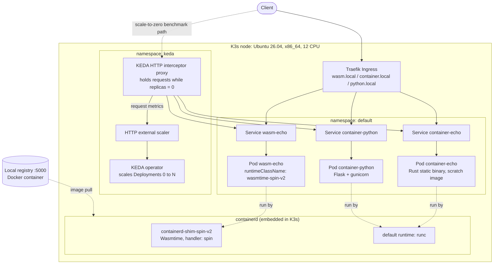

# Architecture

Single-node K3s cluster where WebAssembly pods and regular container pods are scheduled side by side.
The only difference from Kubernetes' point of view is `runtimeClassName` on the WASM Deployment.

## How the pieces map to this repo

| Piece | Where |
|---|---|
| K3s + Spin shim install | `scripts/01-install-k3s-wasm.sh` |
| RuntimeClass `wasmtime-spin-v2` (handler `spin`) | `k8s/base/runtimeclass-spin.yaml` |
| WASM app (Rust, Spin SDK 6, wasm32-wasip2) | `apps/wasm-echo/` |
| Container equivalents (Rust scratch, Python) | `apps/container-echo/`, `apps/container-python/` |
| Deployments, Services, Ingress | `k8s/base/` |
| Scale-to-zero (InterceptorRoute + ScaledObject) | `k8s/keda/scale-to-zero.yaml` |

## Notes on what the diagram does and does not show

- The scale-from-zero benchmark sent requests **directly to the interceptor's ClusterIP**, not through Traefik. Traefik-to-interceptor chaining was not built or tested.
- Containers run through the default runtime (`runc`); only the WASM pod goes through the Spin shim.
- The local registry runs in Docker on the host and is reached by K3s through `registries.yaml`.
